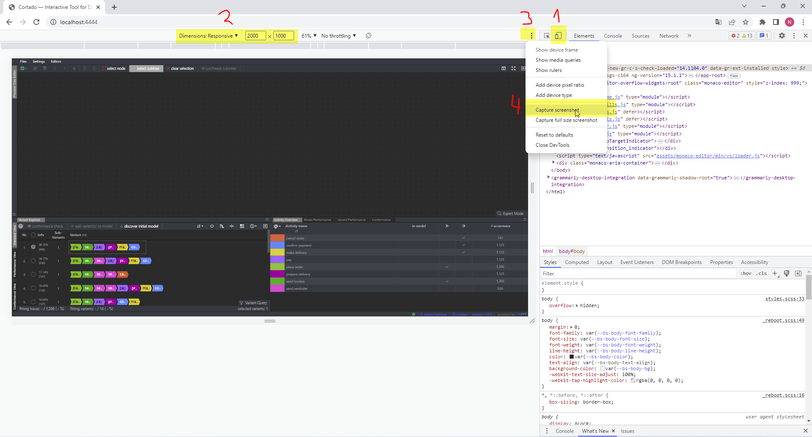

## Internal Notes (remove or move to different location before publication)
### Create Screenshots
For the sake of consistency, screenshots of the complete cortado-application should have the same size. Therefore, start the backend and the frontend and open the frontend in Google Chrome at `http://localhost:4444/`. Open the google chrome developer tools (shortcut `F12`). Follow the next four steps, which are also depicted in the screenshot below:
1. Open the device toolbar
2. Set resolution to 2000 x 1000
3. Open the context menu
4. Click `Capture screenshot`

## Incremental Process Discovery

### Initial Model
The incremental process discovery starts with an initial model. You have multiple options to create an initial model:

1. Click `Files` &rarr; `Import process tree (.ptml)` to import an existing process tree from a file.
2. Use the process tree editor to create a model by hand.
3. Select variants by checking their checkboxes in the variant explorer and click `discover initial model`. The model is discovered using the behavior in the selected variants.

### Incrememtal Discovery
To increase the current model's language, select additional variants by checking their checkboxes in the variant explorer. Then, click `add variant(s) to model` to add the variants to the model. 

> **_NOTE:_**  Selected variants are guaranteed to be in the models language after clicking `add variant(s) to model`. They are guaranteed to stay in the model's language as long as they are selected. Unselcting a variant removes this guarantee. 
