# Contribution Guidelines

Internal Notes (remove or move to different location before publication)

## Creating Screenshots

Screenshots can be captured consistently by using the fixed cortado window of electron.

### Screenshot without border

### Screenshot with border

||
-

### Producing GIFs

- Use https://www.screentogif.com/screenshots for creating GIFs similar to the ones below.
- Any part of the screen can be put into the frame that records the GIF.
- There's also a convenient way to post-process and edit the recorded GIFs. 
- It should be made sure to crop out the extra cursor movements at the start or end of the recordings.

||
-

||
-

### Drawing boxes on screenshots:

  * Drawing numbered boxes on images to refer to sections:
    * Box: Rectangle with 3px border. 
    * Number Text: Calibri, size: 26pt, Bold. 
    * Color Palette for box border and text:
      * Red: #C7171E
      * Green: #22B14C 
      * Purple: #C659C7
      * Blue: #00A2E8
      * Yellow/Gold: #FFC90E
    * See example below which was produced using **paint** in **windows**:

||
-

&nbsp;

## Referring to buttons / icons:
  * Examples:
    * Use (<i class="bi bi-diagram-2-fill btn-icon">discover initial model</i>) button to discover an initial model.
    * Click `Files` &rarr; <i class="bi bi-file-earmark-arrow-up btn-icon"></i>`Import process tree (.ptml)` to import an existing process tree from a file.
* Use `code blocks` for referring to something in the UI like a button, an item in the menu or any displayed label in Cortado.

# Introduction

* What is Cortado about
* General high-level ideas behind the tool
* Contact info etc. and references to publications

# Variant Handling

## Variant Explorer

Selected (marked with <i class="bi bi-check2-circle"></i>) <b>non-fitting</b> variants will be added to the process model.

In the Variant Explorer, users can get a comprehensive list of all variants present in the loaded event log. Unlike classical sequential variants found in other process mining tools, the Variant Explorer captures additional parallel behavior. The explorer also lists [*Variant Fragments*](#variant-fragments). The explorer offers different views on the variants, including:

- **Standard View:** Provides general information about each variant.
- **Performance View:** Refer to section [*Temporal Performance Analysis*](#temporal-performance-analysis).
- **Conformance View:** Refer to section [*Conformance Analysis*](#conformance-analysis).

For each variant, the explorer displays its frequency within the log and the number of sub-variants it has. Variants can be selected for discovering an initial model (<i class="bi bi-diagram-2-fill btn-icon text-success">discover initial model</i>), and they can also be added incrementally (<i class="bi bi-plus-lg btn-icon text-success">add variant(s) to model</i>) (when discovering an initial model there may not be any variant fragments be selected).

When a model is present, conformance is available within the standard view. Click the (<i class="bi bi-question-square btn-icon"></i>) button for individual variant conformance or use (<i class="bi bi-layers-fill btn-icon">conformance check</i>) for all variants. For more detailed conformance insights, refer to the [*Conformance Analysis*](#conformance-analysis) section. Variants can also be deleted by hovering over a variant row and clicking the deletion icon.

Besides that there are also multiple actions available from the <i class="bi bi-tools btn-icon"></i>`Functions` dropdown menu within the toolbar of the variant explorer. For there functionalities refer to the corresponding sections.

Beneath the listed variants, there are also statistic displayed for the whole event log, i.e. how many traces/variants are fitting the model or selected.

In the variant explorer, you can perform various actions.

### Variant Information Explorer
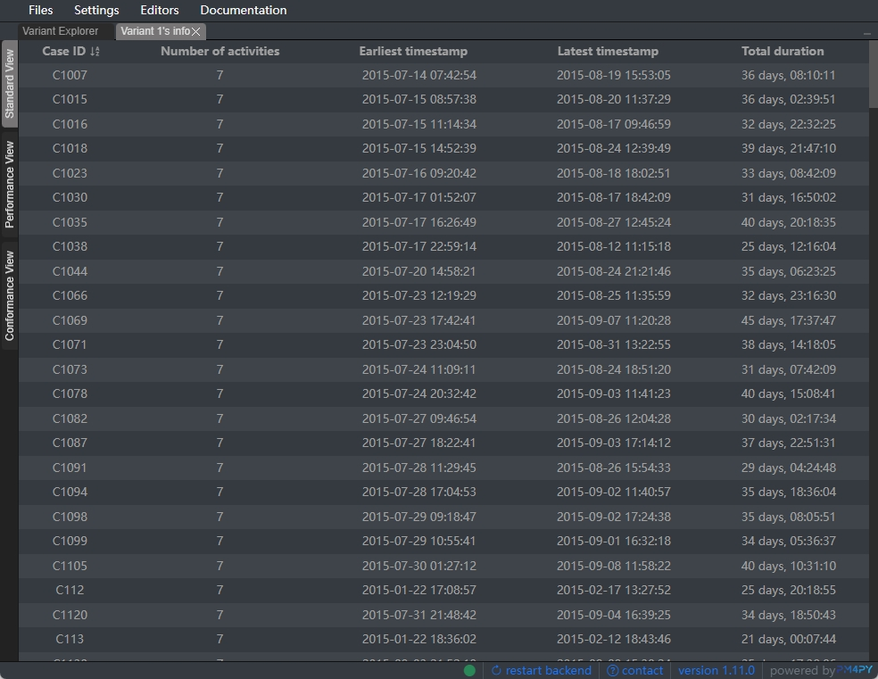
By clicking the variant's count in Variant Explorer, a new Variant Information Explorer window opened in the stack of Variant Explorer. In Variant Information Explorer, all cases of the selected variant are listed, with their information including case ID, earliest and latest timestamp, and duration. The case list could be sorted by case ID (alphabet order), timestamp, and duration.

### Case Information Exploerer
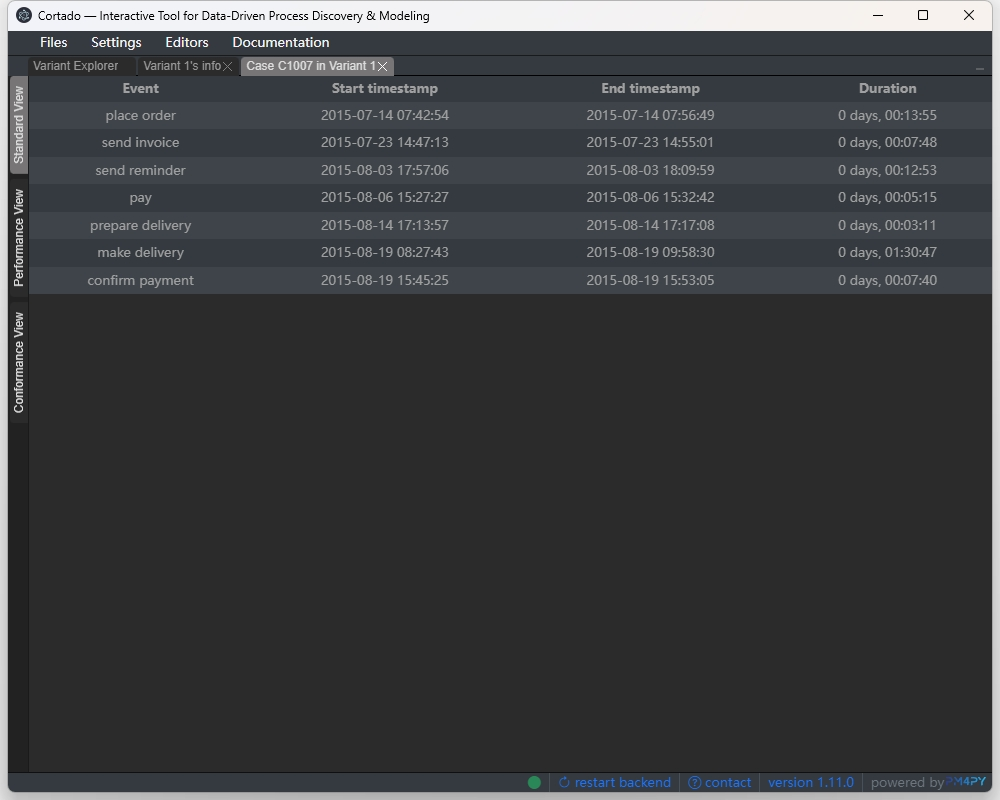
By clicking the case ID in Variant Information Explorer, a new Case Information Explorer window opened in the stack of Variant Explorer. In Case Information Explorer, the events of the selected case are listed in time order, with their information including starting timestamp, ending timestamp, duration, and resources of the event.

### Tiebreaker
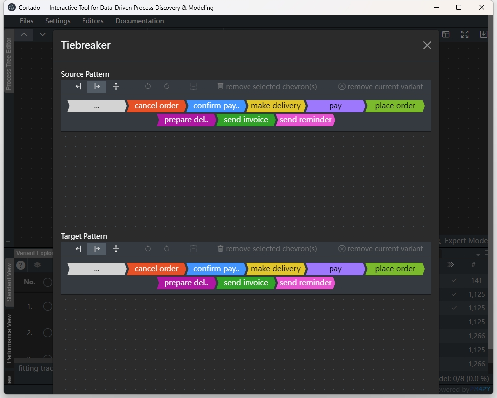
Tiebreaker is a sequentialization tool which provides a function to match source pattern in variants and replace them with the target pattern. In tiebreaker, there are two pattern editors to model the source pattern and target pattern, respectively. In addition to sequential and parallel pattern, the tiebreaker allows to create:
1. choice group, which could match any combination of any activities in the group;  
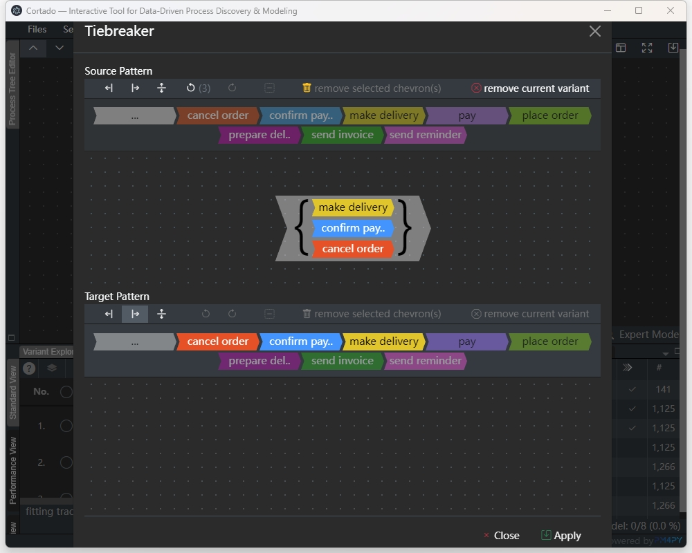
2. fallthrough group;  
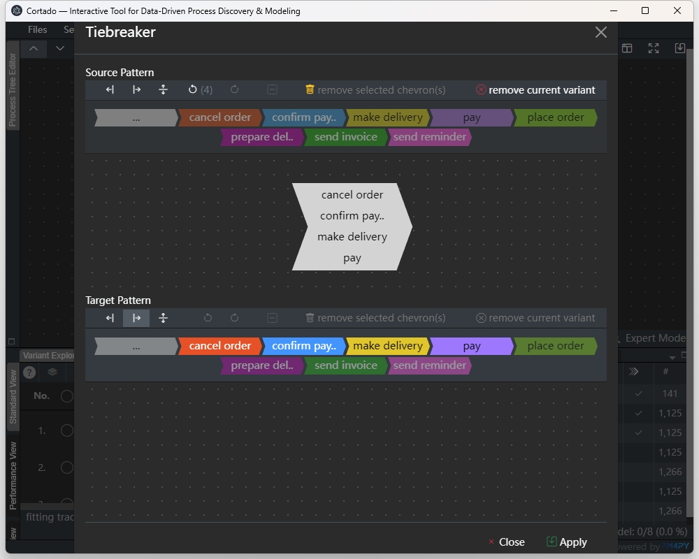
3. pattern with a wildcard option '..' to allow partial match, which represents "rest of the variant".  
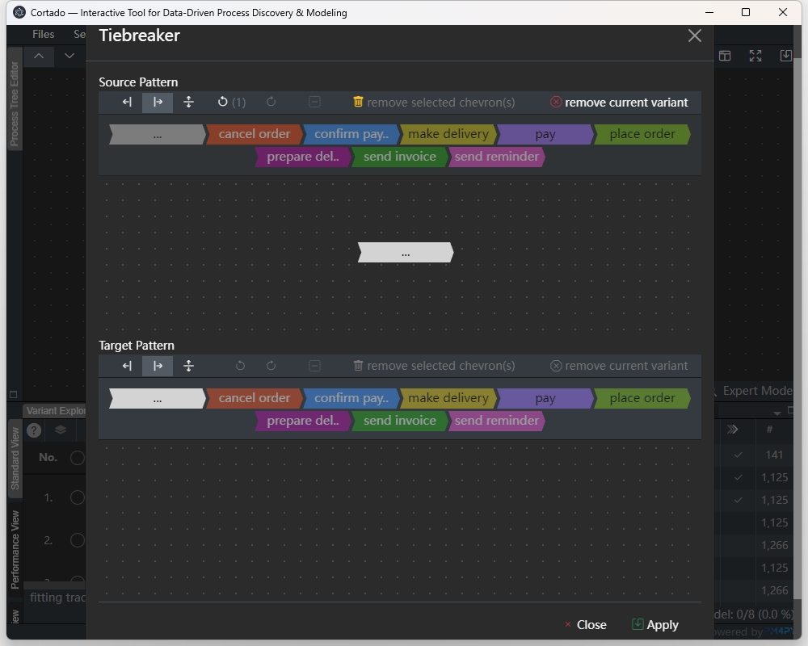

Note：
1. in source pattern, only parallel variants are allowed.
2. The invalid patterns are checked when editing.
3. The activities in target pattern should be consistent with activities in the source pattern. Acitivities in target pattern editor are only enabled when they are already in the source pattern.

Here are some examples to show how variants are transformed by the tiebreaker:
- (1)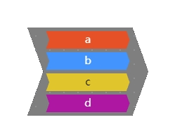
- (2)
- (3)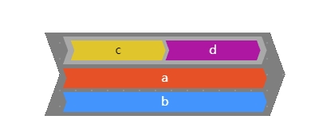
- (4)
- (5)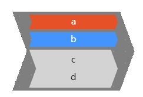

| Source Pattern   | Target Pattern | Result for examples       |
|:-------:|:-----:|----------|
|    |   | (1) No match  (2)   (3) No match  (4) No match  (5) No match    |
|    |   | (1)   (2)   (3) No match  (4)   (5)     |
|    |   | (1) 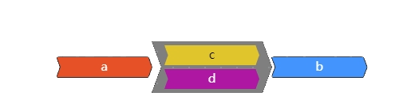  (2)   (3)   (4)   (5)     |
|    |   | (1) No match  (2)   (3) No match   (4)   (5) No match     |
|    |   | (1) 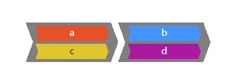  (2)   (3)   (4)   (5)     |
### Variant Sorting

From the dropdown <i class="bi bi-sort-alpha-down btn-icon"></i>`Sorting` one can sort the listed variants based on different criteria:
- activites: the total number of activties in the event log
- conformance: how the variant conformance is (unknown, fitting and non-fitting)
- frequency: the frequency of variant in event log
- length: the length of the variant
- sub-variants: the number of sub-variants
- user-created: whether or not the variants are user-created (trace-fragments or modelled)

### Collapsing Activity Loops

From the <i class="bi bi-tools btn-icon"></i>`Functions` dropdown menu one can collapse activities occuring multiple times within a trace into looped activites. This is useful for certain event logs where activities repeat very often.
Certain features may be disabled as they are not working with the collapsed loops.

### Low-level Variants

By clicking on the number of sub-variants for a variant, users can inspect the corresponding low-level variants. For each sub-variant, the order in which the starting and ending of activities occur is displayed. Note that the length of the nodes does not correspond to a temporal length of the activity but only to how it started and ended relative to others.

## Variant Clustering

Variant clustering can be used for listing the variants grouped into clusters in the Variant Explorer view. This allows for a convenient way to organize and access similar variants in their respective clusters.

In the Variant Explorer view, clustering settings can be accessed using <i class="bi bi-grid-1x2 btn-icon"></i>`Variant clustering settings` option in the <i class="bi bi-tools btn-icon"></i>`Functions` dropdown menu.

||
-

### Clustering Methods

The Clustering Method dropdown allows for selection of the clustering method. The following clustering techniques are included:

#### Agglomerative edit distance clustering:

- Using this technique, variants are represented as trees and their edit distances are pairwise compared and used as a distance measure between variants during clustering.
- Having selected `Agglomerative edit distance clustering`, the second input field can be used to specify the `Max. Variant Edit Distance Within a Cluster`

#### Label vector clustering:

- Using this technique, vectored labels of activities in variants are used for clustering. The ordering of the labels are ignored.
- Having selected `Label vector clustering`, the second input field can be used to specify the `Number of Clusters`

&nbsp;

After selection of the desired settings, click <i class="bi bi-save btn-icon"></i>`Apply` to apply the settings and cluster all variants in Variant Explorer.

<i class="bi bi-arrow-clockwise btn-icon"></i>`Reset` can be used to discard the clusters and restore to the default list of variants.

### Cluster Information

After applying clustering, variants are grouped in their respective clusters as shown below:

- Using the <i class="bi bi-chevron-down btn-icon"></i> toggle, each cluster can be hidden or expanded.
- Using <i class="bi bi-sort-alpha-down btn-icon"></i>, each cluster can be individually sorted. Note that using the global sorting of Variant Explorer view overrides the sorting of individual clusters.
- Each cluster information bar shows the number of variants and the number traces in that cluster.

||
-

## Variant Querying

A valid **Query** is made up of **Activities** and **Operators**, which together form
expressions that can be linked by logical operators to form more complex queries.
For syntactic reasons, ev**ery query ends with a semicolon ; .
Operators come either as unary or binary operators, which express the relationships
between a single or multiple activities and the variant. As an example for a unary
operator, the following is a query made from a single unary expression that checks
if the activity `'A'` is an event happening in the variant.

`'A' is Contained`

Similarly, a query from a binary expression that checks if every
`'A'` activity in the variant is followed by a `'B'` activity, can be written as:

`'A' is DF 'B'`

| Activities     | Meaning                                                                                                                 |
|----------------|-------------------------------------------------------------------------------------------------------------------------|
| `'Activity'`   | Activity names are written in apostrophes                                                                               |
| `ANY{'A','B'}` | Evaluated in an expression, returns True if any activity for the operator returns True                                  |
| `ALL{'A','B'}` | Evaluated in an expression, returns True if all activities for the operator returns True                                |
| `~`            | Written in front of a group; it represents the group consisting of all activities besides the activites in the brackets |

Groups can be used both in unary and binary operators to replace single
activities. However, this is restricted to only one side of a binary
expression. In case of binary expressions, if the group is located on
the left-side of the expression, it is evaluated by simply checking for
every member of the group and the right-hand side, if the expression
would be fulfilled. The case of a right-hand side group will be covered
below.

| Unary Operator | Meaning                                                      |
|:---------------|--------------------------------------------------------------|
| `isStart`      | Returns True if the activity is a start activity             |
| `isEnd`        | Returns True if the activity is an end activity              |
| `isContained`  | Returns True if the activity is contained inside the variant |

Unary operators express the relationship between a single activity and the
variant. The following query evaluates to True if `'A'` is a start activity of the variant.
Note that it is not necessarily a unique start activity.

`'A' is Start`

For convenience, instead of writing out the full operator name for unary and
binary operators, the letters in bold can be used as a shorthand; thus, we
can write for example `'A' isC` instead of `'A' isContained`.

| Binary Operator        | Meaning                                                                                   |
|------------------------|-------------------------------------------------------------------------------------------|
| `isDirectlyFollowed`   | Returns True if the right-hand activity always directly-follows the left-hand activity    |
| `isEventuallyFollowed` | Returns True if the right-hand activity always follows the left-hand activity             |
| `isParallel`           | Returns True if the right-hand activity always happens parallel to the left-hand activity |

Binary Operators express the relationship between activities in a variant.
For example, `'A' isConcurrent 'B'` is fulfilled, if every occurrence of
`'A'` happens concurrently to a `'B'` activity. To add further expressive power, groups can be
used on the right-hand side of a binary expression to capture some deeper relations.
That is the query

`'A' isDF ANY {'B','C'};`

is fulfilled, if every `'A'` activity is directly followed by an `'B'` or `'C'` activity.
This is different to the interpretation of every `'A'` needing to be followed by a `'B'`
or every `'A'` being followed by a `'C'`

| Quantifiers | Meaning                                                                       |
|-------------|-------------------------------------------------------------------------------|
| `> NUMBER`  | Returns True if the preceding expression is appears more than NUMBER of times |
| `= NUMBER`  | Returns True if the preceding expression is appears exactly NUMBER times      |
| `< NUMBER`  | Returns True if the preceding expression is appears less than NUMBER of times |

Quantifiers can be used to check for the frequency of relations. Instead
of checking if `'A'` is just contained any
number of times,

`'A' isContained > 2`

will only return True, if `'A'` appears at least 3 times in the variant. For binary expressions,
this works similarly, thus `'A' isDF 'B' = 2`, will return True if `'A'` is directly-followed 2
times by `'B'` in the variant. Using Quantifiers in conjunction with Groups need some attention,
as the right-hand side rules also apply here. Thus,

`'A' isDF ALL { 'B', 'C'} > 1`

will only be evaluated as True if at least two A activities are followed by both a `'B'` and a
`'C'` activity.

| Logical Operator | Meaning                                                          |
|------------------|------------------------------------------------------------------|
| `AND`            | Returns True if all the expressions are True                     |
| `OR`             | Returns True if any of the expressions is True                   |
| `NOT`            | Returns True if the content of the following expression is False |

Different unary and binary expressions can be linked using logical operators to build complex
queries. If we for example want to select all variants in which activity `'A'` is either
directly followed by activity `'B'` or eventually followed by activity `'E'`, we can write the
following query:

`'A' isDF 'B' OR 'A' isEF 'E'`

When linking multiple expressions, `AND` and `OR` operators linking expressions can be nested
inside each other by using <b> ( ) </b> parenthesis. We can use this to expand our previous
example by requiring that now every `'A'` activity needs to be followed by an`'E'` activity and
that every `'E'` needs to be followed by an `'F'` activity:

`'A' isDF 'B' OR 'A' isEF 'E'`

`'A' isDF 'B' OR ( 'A' isEF 'E' AND 'E' isEF 'F' );`

Multiple instances of the same operator on the same level can be linked without the need of
parenthesis. `NOT` can be used to negate the expression written after it in <b> ( ) </b>.
As an example, if we want to get all variants that have `'B'` as the unique and only start
activity, we can write the following query:

`'B' isStart AND NOT ( ~ ANY {'B'} isStart );`

The first term checks if `'B'` is a start activity, while the second expression would be
fulfilled if any activity that is not `'B'` would be a start activity. Now, as we negate it,
the expression can only be true if `'B'` is a start activity and no other activity
is a start activity.

## Variant Fragments

Variant fragments or trace fragments are portions of the trace variants which are sequentially complete, meaning that no activity is skipped in a sequence.  
For example,  

is a sequentially complete fragment of the full trace variant ,  
while   
  
is not.

Trace fragments are in contrast to full trace executions which have a well-defined start *and* end activity. These only contain either the start activity or end activity or none.
Based on which of the activities they contain, trace fragments can be categorised into 3 kinds - **infix**, **prefix** and **suffix**. The dots preceding and/or succeeding represent the presence of other fragments before or after the one in question

* **Infix** fragments contain none of the start or end activities and hence they are preceded *and* succeeded by dots. The fragments above are examples of the same

* **Suffix** fragments contain only an end activity.  
  
* **Prefix** fragments contain only an end activity.  
  

Trace fragments are used and can frequently be seen in [*Incremental Discovery*](#incremental-process-discovery), [*Tiebreaker*](#variant-sequentialization) and [*Frequent Pattern Mining*](#variant-frequent-pattern-mining), pool of which can either be -

* manually extracted using [infix selection mode](#extracting-variant-fragments),
* automatically identified,
* discovered in the process of '[Frequent Pattern Mining]((#variant-frequent-pattern-mining))', or
* manually created

### Extracting variant fragments

One way to select infixes (and add them to the pool) is through the `trace infix selection mode`. To enable it in the variant explorer, simply click on (<i class="bi bi-ui-checks-grid btn-icon">Exit trace infix selection mode</i>) option in the (<i class="bi bi-tools btn-icon">Functions</i>) menu.
With the icons on the right, one can add the current selection to the variant explorer, reset selection or select the whole variant.

||
-  

## Variant Modeler
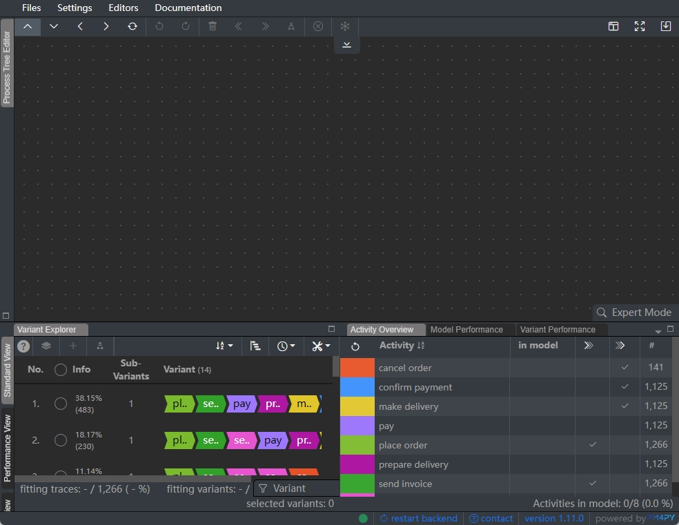

The variant modeler allows users to manually create a variant with sequential and parallel patterns.

How to create a new variant:

1. Select the insertion strategy in the toolbar;
2. Select a chevron (could be both single activity or an activity group);
3. Click the activity button;
4. Click `add new variant to log` button to add the user created variant to the variant list.

Other functions in the tool:
1. Variant modeler allows the variant be displayed in 4 variant types: full, prefix, infix, and postfix.
2. View focus functions are also provided:
    - focus selected: move the selected activity/group to the view center.
    - move the variant center to the view center.

## Variant Frequent Pattern Mining

As the number of variants in a process log increase, it becomes challenging for process analysts to explore event data. This section of Cortado helps mine frequent patterns in event log, or more precisely frequent *infixes* to make analysis easier and to assist incremental discovery.
Under the hood, concurrency variants are modelled as labeled, rooted, ordered trees and infixes as a specific kind of subtrees called *infix subtrees*. More about the representation can be read in one of the published [articles](https://dl.acm.org/doi/abs/10.14778/3603581.3603603). Frequent Miner can also use different algorithms with specific properties and goals - [*Valid Tree Miner*](https://dl.acm.org/doi/abs/10.14778/3603581.3603603), *Blanket Tree Miner* and *Eventually Follows Pattern Miner* being few of them.

To open the `Variant Miner Editor`, go to `Editors` &rarr; (<i class="bi bi-minecart btn-icon"><b>Open</b> Variant Miner</i>).

||
-  

 
The editor comprises primarily of <i>three sections</i>, all of which rely heavily upon the tree representation of variants -  
 
 
1. shows the <b>parameter selection</b>, allowing a choice of support definition, the minimum support threshold used for mining and more
   
   
  <table>
    <thead>
        <tr style="text-align: center;">
            <th>Pattern Selection</th>
            <th>Options (if any)</th>
            <th>Function</th>
        </tr>
    </thead>
    <tbody>
        <tr>
            <td rowspan=4>Support Counting Strategy</td>
            <td>Trace Transaction</td>
            <td>counts the number of occurrences of a sub-pattern, counting each occurrence as one for each trace</td>
        </tr>
        <tr>
            <td>Variant Transaction</td>
            <td>counts the number of occurrences of a sub-pattern, counting each occurrence as one for each variant</td>
        </tr>
        <tr>
            <td>Trace Root-Occurrence</td>
            <td>counts the number of occurrences of a sub-pattern having unique parents, counting each occurrence as one for each trace</td>
        </tr>
        <tr>
            <td>Variant Root-Occurrence</td>
            <td>counts the number of occurrences of a sub-pattern having unique parents, counting each occurrence as one for each variant</td>
        </tr>
        <tr>
            <td>Maximum Size</td>
            <td colspan=2>max size of the pattern. It is not the number of activities but the number of nodes in its tree representation.
              Hence, without any parallelism, it is the number of activities plus one</td>
        </tr>
        <tr>
            <td>Support</td>
            <td colspan=2>minimum number of occurrences to be counted as 'frequent'</td>
        </tr>
        <tr>
            <td>Mine prefixes and suffixes</td>
            <td colspan=2>allow mining prefixes and suffixes, instead of just infixes (see section on 'Variant Fragments' above to know more about infix/prefix/suffix)</td>
        </tr>
        <tr>
            <td>Fold loops</td>
            <td>Loop Threshold</td>
            <td>when specified as `n`, folds all `n` or more consecutive occurrences of an activity into a one single loop before mining </td>
        </tr>
    </tbody>
  </table>
   

2. **Visualization table** shows further information on the infixes - `size`, `support`, `type`, and a `visualization` of the fragment.
   Apart from the `Type` itself, all the rest of the properties are directly taken from the parameter selection before mining. An infix subtree is of *type*
   `Maximal` if no frequent super-pattern exists and it is of *type* `Closed` if none of its proper super-patterns have the same support.  
   In addition, alignments between the infix and an existing process model, i.e., if the infix conforms to the process model, can be computed using
   the (<i class="bi bi-layers-fill btn-icon">conformance check</i>) button right above the table. Subsequently, if the infixes 'fit' to the model or not can also be seen
   in the `Fitting` column of the table. Apart from the above, it is also possible to export the mined infixes as svg for analysis,
   by clicking on (<i class="bi bi-save"></i>) button located in the top-right corner of the editor.

3. finally in the **Filters** menu, a user can choose which of the infixes to retain. Here, the option `Valid` for `Type` retains only *valid* infixes, meaning the infixes in which all operator nodes have at least one child.
   The section at the bottom allows users to selectively filter in or out certain activities. For instance, for a particular activity, checking the box for `Filter` and turning the toggle switch for `Out/In` on, retains only the infixes *containing* the activity.
   Switching the toggle off, retains only the infixes *not* containing the activity.

## Variant Sequentialization (Tiebreaker)

# Process Discovery

## Visualizing and Editing Process Models

### Process Tree Editor

Process tree editor tab is open by default in the top pane, it can also be accessed using <i class="bi bi-diagram-2 btn-icon"></i> `Open Process Tree Editor` option in `Editors` dropdown menu. The `Process Tree Editor` tab is also always available in the list of tabs to the left of the top pane. 
After a tree is available in the process tree editor by either importing or through discovery, it can be edited in the following ways.

#### Selecting Nodes for Updates

A tree node (either activity or operator) can be selected for updates by clicking on it. After selection of a node, all buttons of updates available for that node are enabled. 

After selecting a node, clicking the <i class="bi bi-x-circle btn-icon"></i>`clear selection` button or clicking the node again, clears that selection.

A selected node is highlighted through a red border as follows:

||
-

#### Inserting Nodes
New nodes available for insertion in the tree are available in the process tree toolbox. The toolbox can be revealed using the <i class="btn-icon bi bi-chevron-bar-down"></i> button at the top of the editor.

||
-

##### Inserting nodes along operators

After selecting an operator node, the following choices are available:
- insert new node above the selected one (<i class="bi bi-chevron-up"></i>)
- insert new node below the selected one (<i class="bi bi-chevron-down"></i>)
- insert new node left to the selected one (<i class="bi bi-chevron-left"></i>)
- insert new node right to the selected one (<i class="bi bi-chevron-right"></i>)

Having selected the following operator and **insert new node below** option, adding an activity from the list of available activities in the toolbox adds it under the selected operator follows:

 &rarr; 

Similarly, adding an operator adds that operator **below** the selected operator. It works similarly for adding activities or operators **above**, to the **left** or to the **right**. 

##### Inserting nodes along activities

After selecting an activity, the following choices are available:
- insert new node left to the selected one (<i class="bi bi-chevron-left"></i>)
- insert new node right to the selected one (<i class="bi bi-chevron-right"></i>)

Having selected the following activity and **insert new node right to the selected one** option, adding an activity from the list of available activities in the toolbox adds it to the right of the selected activity as follows:

 &rarr; 

Similarly, adding an operator adds that operator **to the right** the selected activity. It works similarly for adding activities or operators **to the left**.

#### Replacing Nodes

The `replace the currently selected node` (<i class="bi bi-arrow-repeat"></i>) option can be used to replace a selected activity or operator node with either an activity or an operator node from the list of available activities and operators in the toolbox.

Having selected an activity and **replace the currently selected node** option, choosing another activity from the toolbox replaces the selected activity as follows: 

 &rarr; 

Similarly, choosing an operator node from the toolbox **replaces** the selected activity with the selected operator. It works similarly for **replacing** selected operators with either operators or activities form the list of available operators and activities in the toolbox. 

#### Removing Nodes

Selecting an operator node or an activity and clicking the <i class="bi bi-trash btn-icon"></i>`remove selected node(s)` button removes that activity or the operator node along with all child nodes.

Having selected an operator node and removing it results as follows:

 &rarr; 

#### Shifting Nodes
Selecting an operator node or an activity and clicking the <i class="bi bi-chevron-double-left btn-icon"></i>`shift selected node(s) to left` or <i class="bi bi-chevron-double-right btn-icon"></i>`shift selected node(s) to right` button **shifts** the selected node to the left or to the right respectively. 
The shift to right or to the left is with respect to the sibling node(s) of the selected node under a single operator.

Having selected the following operator node and clicking the <i class="bi bi-chevron-double-left btn-icon"></i>`shift selected node(s) to left` button **shifts** the operator node to the left as follows:

 &rarr; 

#### Applying Reduction Rules

Selecting an operator node and clicking the <i class="bi bi-diagram-2"></i> button applies **reduction rules** to remove redundant and unnecessary nodes from that subtree.

#### (Un)Freezing Subtrees

Freezing a subtree prevents that subtree from being updated during the incremental discovery process and this subtree always remains in the tree.  

Selecting an operator node and clicking the <i class="bi bi-snow btn-icon"></i>`(un)freeze subtrees` button **freezes** the subtree under that operator node. The frozen subtree is highlighted blue as seen below:

Similarly, selecting root operator node of an already frozen subtree and clicking the <i class="bi bi-snow btn-icon"></i>`(un)freeze subtrees` button unfreezes that subtree. After unfreezing, that subtree may be updated diring the incremental discovery process and its presence is no longer ensured.

#### Undo/Redo Applied Changes

During the process of updating the tree, history is maintained and the edits can be undone or redone using the <i class="bi bi-arrow-counterclockwise btn-icon"></i>`undo` and <i class="bi bi-arrow-clockwise btn-icon"></i>`redo` buttons.

#### Exporting the Model

The current tree in the process tree editor can be exported (.svg) using the <i class="bi bi-save"></i>`export the tree as an .svg` button.

### BPMN-Visualizer

BPMN visualizer can be accessed using <i class="bi bi-diagram-2 btn-icon rotate-270"></i> `Open BPMN Viewer` option in `Editors` dropdown menu. The `BPMN Viewer` tab is also available in the list of tabs to the left of the top pane after it was accessed. 
After a tree is available in the process tree editor by either importing or through discovery, the BPMN representation of that process tree is available in the BPMN viewer.

#### Selecting Nodes for Updates

A node can be selected for updates by clicking on it. After selection of a node, all buttons of updates available for that node are enabled. 

After selecting a node, clicking the <i class="bi bi-x-circle btn-icon"></i>`clear selection` button or clicking the node again, clears that selection.

A selected node is highlighted through a red border as follows:

||
-

#### Removing Nodes

Selecting a node and clicking the <i class="bi bi-trash btn-icon"></i>`remove selected node(s)` button removes that node as well as the relevant connected nodes from the BPMN model.

Having selected a node and removing it results as follows:

 &rarr; 

#### Exporting the Model

The current BPMN model in the BPMN viewer can be exported (.svg) using the <i class="bi bi-save"></i>`export the model as an .svg` button.

## Incremental Process Discovery

### Idea and Overview

Cortado uses incremental process discovery which involves incrementally discovering a process model by adding trace by trace to an existing process model. 
Thereby, the process model under construction gets incrementally extended. Using the trace to be added in an iteration, specific parts 
of the process tree which must be altered to fit the trace are identified. This is followed by updates to those identified parts which 
allow the trace to fit the process tree. 

After discovering or importing an initial process tree, trace(s) can be chosen for incrementally adding them to the process tree.  

### Discovering Initial Model

* An initial model can be discovered using the following steps:
  1. Select variant(s) in the `Variant Explorer`
  2. Press the <i class="bi bi-diagram-2-fill btn-icon"></i>`discover initial model` button
  3. The discovered process tree would be displayed in the `Process Tree Editor` as follows:

### Incrementally Adding Variants

* Variant(s) can be incrementally added to the process model using the following steps:
  1. Select variant(s) in the `Variant Explorer` that are not yet added to the process tree.
  2. Press the <i class="bi bi-plus-lg btn-icon"></i>`add variant(s) to model` button
  3. The modified process tree (which the selecting traces are fitting to) would be displayed in the `Process Tree Editor` as follows:
  

# Temporal Performance Analysis

* Model-independent performance analysis
* Model-based performance analysis
## Model-independent performance analysis
When opening the Performance View from the side bar, the performance of each variant is calculated, which may take a while depending on the size of the event log. 
In this view the variants are no longer uniquely colored to be differentiated but based on their service times. Additionally, there are now nodes displayed inbetween activites to show the waiting times. These are colored using a separate color scale to show their waiting times. 

Both color maps can be seen in a sub-tab from the `Variant Performance` tab.
Here the used statistic for the color maps can be changed from their default showing the mean values of all instances for each variant to other statisics such as their minimum, maximum or standard deviation. Upon change the color map will be immediatley be updated.

To get further insight into the performance of certain parts of a variant, let it be single activites, waiting nodes or parallel sections, one can simply click on them in the Variant Explorer and inspect their service or waiting times in the `Selection` sub-tab of the `Variant Performance` tab.

## Model-based performance analysis 
For understanding the performance of a process model one can project the performance of selected variants onto the model from the Performance View. When there is a model present there will be two additional columns in the Variant Explorer, namely `Model Projection` and by default `service time (mean)`.

By clicking the toggle in the `Model Projection` column the variant will be added to the pool of projected variant. On the other hand unclicking the toggle of already projected variants will remove them again from the pool. To clear the whole pool one can click (<i class="bi bi-x-circle-fill btn-icon"></i>) in the header of the `Model Projection` column.

Please note that in most cases it only makes sense to project variants that are actually fitting the process tree as otherwise the projection is not complete. Because of that there will be a warning sign displayed for variant that are actually not fitting.

The other column shows in the default setting the mean service overall model performance of the variant.

Further information can be gained from `Model Performance` tab. Here in the `Selection` subtab the *service time*, *waiting time*, *cycle time* and *idle time* are shown for the selection made within the model.
The same information can be gained for certain process tree nodes by hovering over them. 

In the `Color Map` subtab adjustments can be made to how the model is colored and the statistics are aggregated.
One can choose which of the four performance times will be used for the projection as well between the statistical measure (mean, min, max, stdev). 

The changes made to this will also change what will be displayed in the variants explorer column.

# Software Architecture

