# Introduction
* What is Cortado about
* General high-level ideas behind the tool
* Contact info etc. and references to publications 

&nbsp;
# Variant Handling 

&nbsp;
## Variant Explorer
Selected (marked with <i class="bi bi-check2-circle"></i>) <b>non-fitting</b> variants will be added to the process model. 

Selected (marked with <i class="bi bi-check2-circle"></i>) <b>fitting</b> variants will remain in the process tree's language when incrementally adding new variants.

* Variants (high-level variants)
* Low-level Variants (Subvariants)
* Sorting Variants

In the variant explorer, you can perform various actions.

### Variant Information Explorer
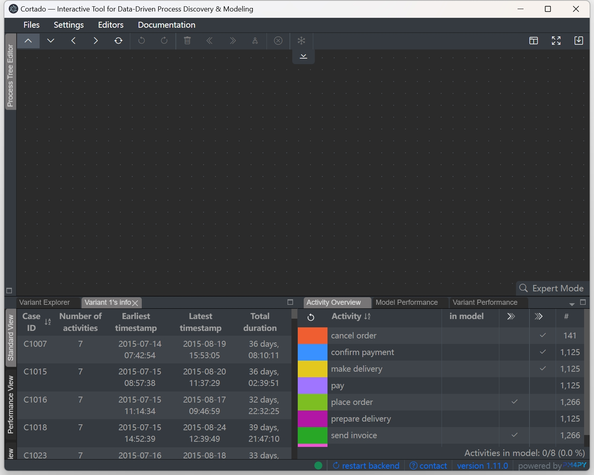
By clicking the variant's count in Variant Explorer, a new Variant Information Explorer window opened in the stack of Variant Explorer. In Variant Information Explorer, all cases of the selected variant are listed, with their information including case ID, earliest and latest timestamp, and duration. The case list could be sorted by case ID (alphabet order), timestamp, and duration.

### Case Information Exploerer
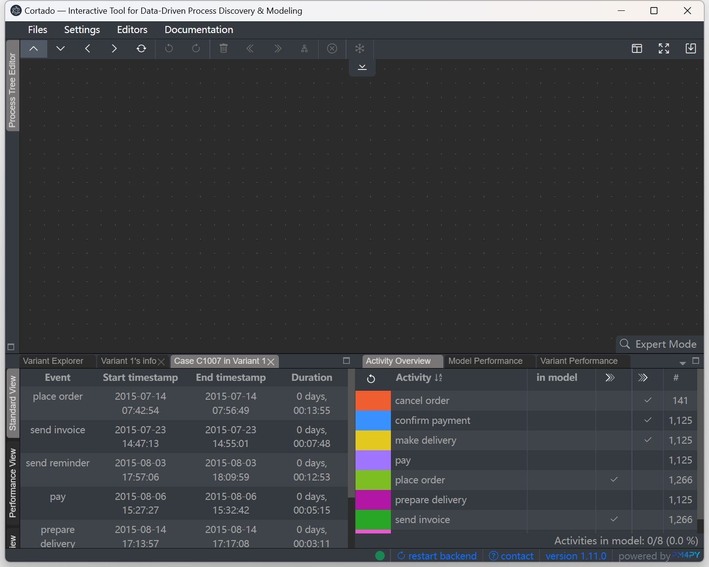
By clicking the case ID in Variant Information Explorer, a new Case Information Explorer window opened in the stack of Variant Explorer. In Case Information Explorer, the events of the selected case are listed in time order, with their information including starting timestamp, ending timestamp, duration, and resources of the event.

### Tiebreaker
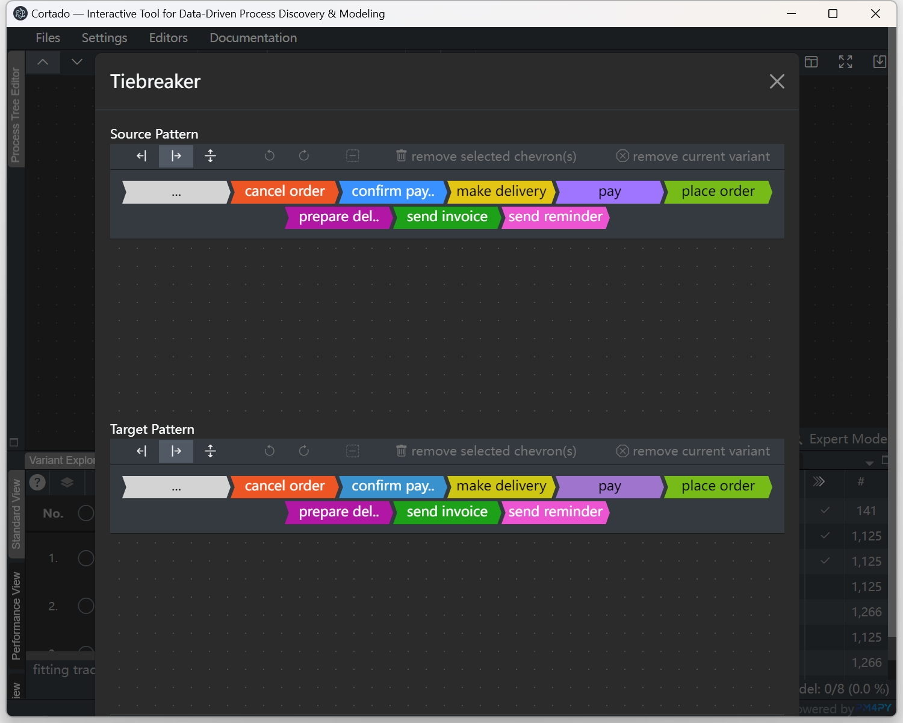
Tiebreaker is a sequentialization tool which provides a function to match source pattern in variants and replace them with the target pattern. In tiebreaker, there are two pattern editors to model the source pattern and target pattern, respectively. In addition to sequential and parallel pattern, the tiebreaker allows to create:
1. choice group, which could match any combination of any activities in the group;
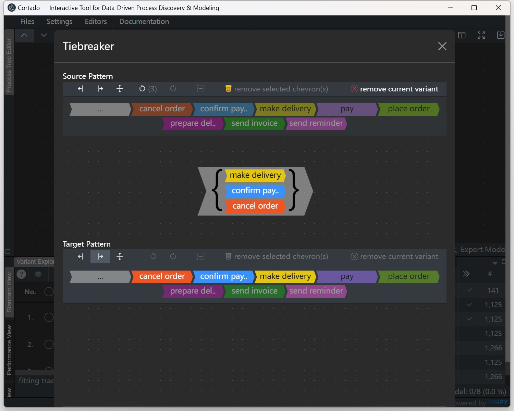
2. fallthrough group;
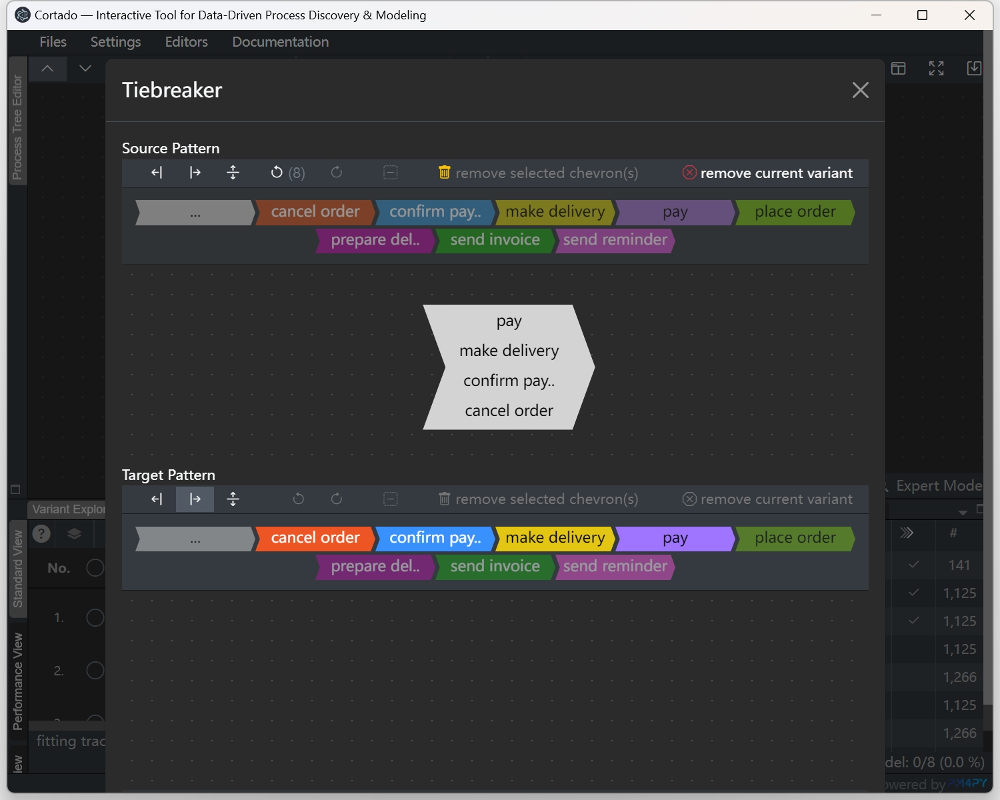
3. pattern with a wildcard option '..' to allow partial match, which represents "rest of the variant".
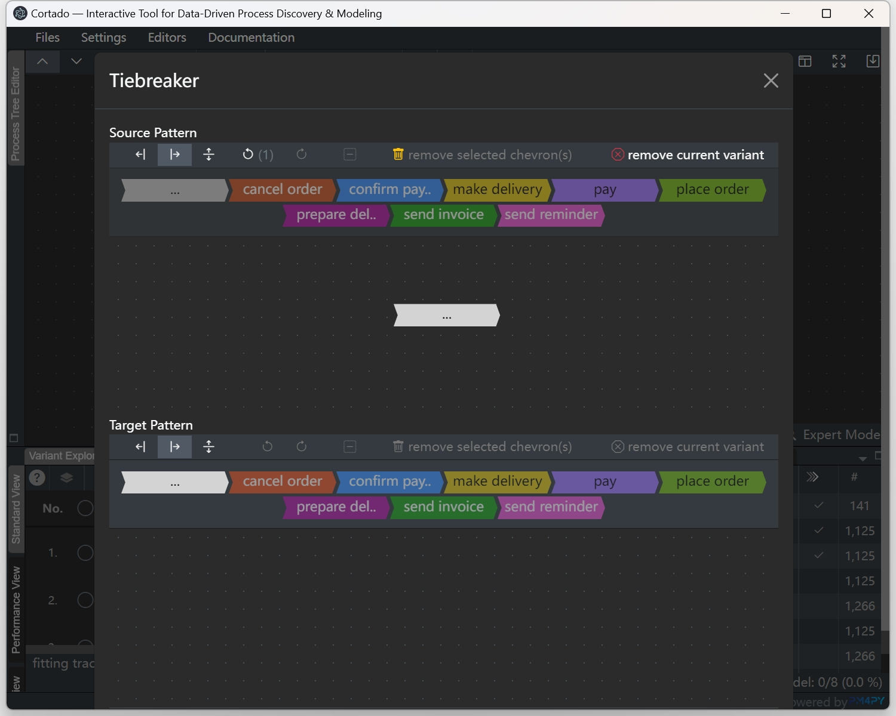

Note：
1. in source pattern, only parallel variants are allowed.
2. The invalid patterns are checked when editing.
3. The activities in target pattern should be consistent with activities in the source pattern. Acitivities in target pattern editor are only enabled when they are already in the source pattern.

Here are some examples to show how variants are transformed by the tiebreaker:
- (1)
- (2)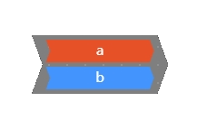
- (3)
- (4)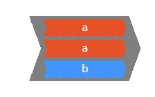
- (5)

| Source Pattern   | Target Pattern | Result for examples       |
|:-------:|:-----:|----------|
|    |   | (1) No match  (2)   (3) No match  (4) No match  (5) No match    |
| 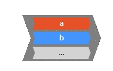   |   | (1) 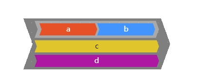  (2)   (3) No match  (4)   (5)     |
|    |   | (1)   (2)   (3)   (4)   (5)     |
| 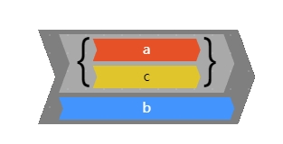   | 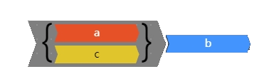  | (1) No match  (2)   (3) No match   (4)   (5) No match     |
| 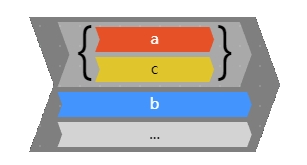   |   | (1)   (2)   (3)   (4)   (5)     |

&nbsp;
## Variant Clustering 

&nbsp;
## Variant Querying
A valid **Query** is made up of **Activities** and **Operators**, which together form 
expressions that can be linked by logical operators to form more complex queries.
For syntactic reasons, ev**ery query ends with a semicolon ; .
Operators come either as unary or binary operators, which express the relationships 
between a single or multiple activities and the variant. As an example for a unary 
operator, the following is a query made from a single unary expression that checks 
if the activity `'A'` is an event happening in the variant.

`'A' is Contained`

Similarly, a query from a binary expression that checks if every 
`'A'` activity in the variant is followed by a `'B'` activity, can be written as:

`'A' is DF 'B'`

| Activities                           | Meaning                                                                                                                 |
|--------------------------------------|-------------------------------------------------------------------------------------------------------------------------|
| `'Activity'`                         | Activity names are written in apostrophes                                                                               |
| `ANY{'A','B'}` &nbsp; &nbsp; &nbsp;  | Evaluated in an expression, returns True if any activity for the operator returns True                                  |
| `ALL{'A','B'}`                       | Evaluated in an expression, returns True if all activities for the operator returns True                                |
| `~`                                  | Written in front of a group; it represents the group consisting of all activities besides the activites in the brackets |

&nbsp;

Groups can be used both in unary and binary operators to replace single
activities. However, this is restricted to only one side of a binary
expression. In case of binary expressions, if the group is located on
the left-side of the expression, it is evaluated by simply checking for
every member of the group and the right-hand side, if the expression
would be fulfilled. The case of a right-hand side group will be covered
below.

| Unary Operator  &nbsp; &nbsp; &nbsp; | Meaning                                                      |
|:-------------------------------------|--------------------------------------------------------------|
| `isStart`                            | Returns True if the activity is a start activity             |
| `isEnd`                              | Returns True if the activity is an end activity              |
| `isContained`                        | Returns True if the activity is contained inside the variant |

&nbsp;

Unary operators express the relationship between a single activity and the 
variant. The following query evaluates to True if `'A'` is a start activity of the variant. 
Note that it is not necessarily a unique start activity.

`'A' is Start`

For convenience, instead of writing out the full operator name for unary and
binary operators, the letters in bold can be used as a shorthand; thus, we 
can write for example `'A' isC` instead of `'A' isContained`.

| Binary Operator                               | Meaning                                                                                   |
|-----------------------------------------------|-------------------------------------------------------------------------------------------|
| `isDirectlyFollowed`                          | Returns True if the right-hand activity always directly-follows the left-hand activity    |
| `isEventuallyFollowed`  &nbsp; &nbsp; &nbsp;  | Returns True if the right-hand activity always follows the left-hand activity             |
| `isParallel`                                  | Returns True if the right-hand activity always happens parallel to the left-hand activity |

&nbsp;

Binary Operators express the relationship between activities in a variant.
For example, `'A' isConcurrent 'B'` is fulfilled, if every occurrence of 
`'A'` happens concurrently to a `'B'` activity. To add further expressive power, groups can be 
used on the right-hand side of a binary expression to capture some deeper relations. 
That is the query

`'A' isDF ANY {'B','C'};`

is fulfilled, if every `'A'` activity is directly followed by an `'B'` or `'C'` activity. 
This is different to the interpretation of every `'A'` needing to be followed by a `'B'` 
or every `'A'` being followed by a `'C'`

| Quantifiers  &nbsp; &nbsp; &nbsp; | Meaning                                                                         |
|-----------------------------------|---------------------------------------------------------------------------------|
| `> NUMBER`                        | Returns True if the preceding expression is appears more than NUMBER of times   |
| `= NUMBER`                        | Returns True if the preceding expression is appears exactly NUMBER times        |
| `< NUMBER`                        | Returns True if the preceding expression is appears less than NUMBER of times   |

&nbsp;

Quantifiers can be used to check for the frequency of relations. Instead
of checking if `'A'` is just contained any
number of times,

`'A' isContained > 2`

will only return True, if `'A'` appears at least 3 times in the variant. For binary expressions, 
this works similarly, thus `'A' isDF 'B' = 2`, will return True if `'A'` is directly-followed 2 
times by `'B'` in the variant. Using Quantifiers in conjunction with Groups need some attention, 
as the right-hand side rules also apply here. Thus,

`'A' isDF ALL { 'B', 'C'} > 1`

will only be evaluated as True if at least two A activities are followed by both a `'B'` and a 
`'C'` activity.

| Logical Operator  &nbsp; &nbsp; &nbsp;  | Meaning                                                           |
|-----------------------------------------|-------------------------------------------------------------------|
| `AND`                                   | Returns True if all the expressions are True                      |
| `OR`                                    | Returns True if any of the expressions is True                    |
| `NOT`                                   | Returns True if the content of the following expression is False  |

&nbsp;

Different unary and binary expressions can be linked using logical operators to build complex 
queries. If we for example want to select all variants in which activity `'A'` is either
directly followed by activity `'B'` or eventually followed by activity `'E'`, we can write the 
following query:

`'A' isDF 'B' OR 'A' isEF 'E'`

When linking multiple expressions, `AND` and `OR` operators linking expressions can be nested 
inside each other by using <b> ( ) </b> parenthesis. We can use this to expand our previous 
example by requiring that now every `'A'` activity needs to be followed by an`'E'` activity and 
that every `'E'` needs to be followed by an `'F'` activity:

`'A' isDF 'B' OR 'A' isEF 'E'`

`'A' isDF 'B' OR ( 'A' isEF 'E' AND 'E' isEF 'F' );`

Multiple instances of the same operator on the same level can be linked without the need of 
parenthesis. `NOT` can be used to negate the expression written after it in <b> ( ) </b>. 
As an example, if we want to get all variants that have `'B'` as the unique and only start 
activity, we can write the following query:

`'B' isStart AND NOT ( ~ ANY {'B'} isStart );`

The first term checks if `'B'` is a start activity, while the second expression would be 
fulfilled if any activity that is not `'B'` would be a start activity. Now, as we negate it, 
the expression can only be true if `'B'` is a start activity and no other activity 
is a start activity.

&nbsp;
## Variant Fragments
* Variant prefixes, infixes, postfixes
* Extracting 	 

&nbsp;
## Variant Modeler

The variant modeler allows users to manually create a variant with sequential and parallel patterns.

How to create a new variant:

1. Select the insertion strategy in the toolbar;
2. Select a chevron (could be both single activity or an activity group);
3. Click the activity button;
4. Click `add new variant to log` button to add the user created variant to the variant list.

Other functions in the tool:
1. Variant modeler allows the variant be displayed in 4 variant types: full, prefix, infix, and postfix.
2. View focus functions are also provided:
    - focus selected: move the selected activity/group to the view center.
    - move the variant center to the view center.

&nbsp;
## Variant Frequent Pattern Mining 

&nbsp;
## Variant Sequentialization (Tiebreaker) 

&nbsp;
# Process Discovery 

&nbsp;
## Visualizing & Editing Process Models
* Process Tree Editor
* BPMN-Visualizer 

&nbsp;
## Incremental Process Discovery 

&nbsp;
# Temporal Performance Analysis
* Model-independent performance analysis
* Model-based performance analysis 

 &nbsp;
# Software Architecture

